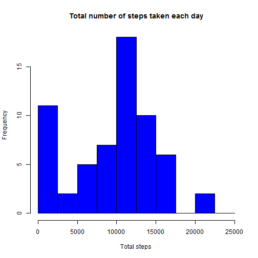
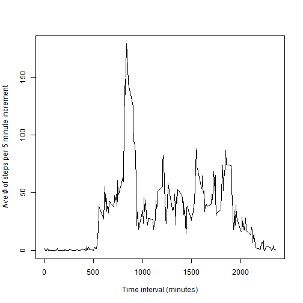
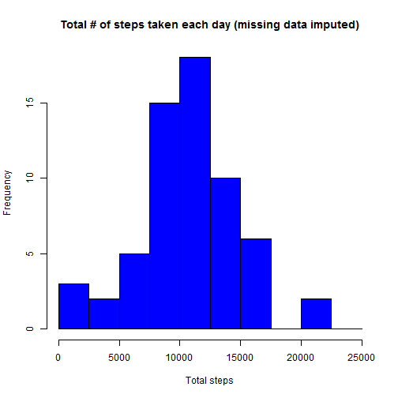

Activity Monitoring Data Analysis
========================================================

## Loading and preprocessing the data
This analysis makes use of data from a personal activity monitoring device. The device collected data at 5 minute intervals through out the day. The data consists of two months of data from an anonymous individual collected during the months of October and November, 2012 and include the number of steps taken in 5 minute intervals each day.

We begin by loading the data.

```r
unzip("repdata-data-activity.zip")
activity <- read.csv("activity.csv", colClasses = c("numeric", "Date", "numeric"), 
    na.strings = "NA")
```


## What is the mean total number of steps taken per day?

The loop that follows is responsible for calculating the total steps for each day follows.


```r

total_steps_by_day <- numeric()
for (j in 0:60) {
    one_day_steps <- numeric()
    for (i in 0:287) {
        one_day_steps <- c(one_day_steps, activity$steps[i + 287 * j])
    }
    one_day_total <- sum(one_day_steps, na.rm = TRUE)
    total_steps_by_day <- c(total_steps_by_day, one_day_total)
}

total_steps <- sum(activity$steps, na.rm = TRUE)
total_days <- max(activity$date) - min(activity$date) + 1
total_steps/as.numeric(total_days)
```

```
## [1] 9354
```


Below is a histogram of the total number of steps taken on each of the 61 days in the data set.


```r
hist(total_steps_by_day, breaks = 10, col = "blue", main = "Total number of steps taken each day", 
    xlab = "Total steps")
```

 


```r
cat("The mean total number of steps taken per day is", mean(total_steps_by_day), 
    "and the median is", median(total_steps_by_day))
```

```
## The mean total number of steps taken per day is 9371 and the median is 10399
```


## What is the average daily activity pattern?

This series of loops calculates the number of steps for each 5 minute increment.


```r
## The outer loop is reponsible for incrementing each of the observations.
## There are 288 total observations.
all_obs_steps <- numeric()
for (j in 0:287) {
    
    ## The inner loop finds the total steps for a single day.  Start by
    ## initializing steps_one_day and total_steps.
    steps_one_day <- 0
    total_steps <- numeric()
    for (i in 0:60) {
        steps_one_day <- activity$steps[i * 288 + 5 * j]
        total_steps <- c(total_steps, steps_one_day)
    }
    step_sum <- sum(total_steps, na.rm = TRUE)
    all_obs_steps <- c(all_obs_steps, step_sum)
    all_obs_steps
}
```


Now that data is used for a plot of the average number of steps vs. time in 5 minute increments.


```r
ave_all_obs_steps <- all_obs_steps/61
plot(activity$interval[1:288], ave_all_obs_steps, type = "l", xlab = "Time (minutes)", 
    ylab = "Ave # of steps per 5 minute increment")
```

 


Now, we find the 5 minute increment with the maximum number of steps.

```r
for (i in 1:288) {
    if (all_obs_steps[i] == max(all_obs_steps)) {
        cat("The 5-minute interval, on average across all the days in the dataset that contains the maximum number of steps is", 
            5 * i)
        
    }
}
```

```
## The 5-minute interval, on average across all the days in the dataset that contains the maximum number of steps is 685
```


## Imputing missing values

Before imputing missing values, the number of missing values was calculated with a loop.


```r
total_na = 0
for (i in 1:17568) {
    if (is.na(activity$steps[i])) {
        total_na = total_na + 1
    }
}
cat("The total number of missing values in the data set is", total_na)
```

```
## The total number of missing values in the data set is 2304
```


The imputation strategy used was to impute the mean for each 5-minute interval in place of the missing values. 

```r
activity_imputed <- activity
for (i in 1:17568) {
    imod <- i%%288
    if (imod == 0) {
        imod <- 288
    }
    if (is.na(activity$steps[i])) {
        activity_imputed$steps[i] <- ave_all_obs_steps[imod]
    }
}
```


The same strategy as above was used to get the total number of steps for each day with the imputed data.

```r
total_steps_by_day_imp <- numeric()
for (j in 0:60) {
    one_day_steps_imp <- numeric()
    for (i in 0:287) {
        one_day_steps_imp <- c(one_day_steps_imp, activity_imputed$steps[i + 
            287 * j])
    }
    one_day_total_imp <- sum(one_day_steps_imp, na.rm = TRUE)
    total_steps_by_day_imp <- c(total_steps_by_day_imp, one_day_total_imp)
}
total_steps_imp <- sum(activity_imputed$steps, na.rm = TRUE)
```

The following histogram includes the imputed data. Note that this histogram's central mode is more pronounced since some of the data near zero in the first histogram has been shifted.

```r
hist(total_steps_by_day_imp, breaks = 10, col = "blue", main = "Total # of steps taken each day (missing data imputed)", 
    xlab = "Total steps")
```

 


```r
cat("With missing data imputed, mean total number of steps taken per day is", 
    mean(total_steps_by_day_imp), "and the median is", median(total_steps_by_day_imp))
```

```
## With missing data imputed, mean total number of steps taken per day is 10559 and the median is 10520
```


## Are there differences in activity patterns between weekdays and weekends?

Now we will examine the question of whether there is a difference between the individual's activity patterns on the weekend and on weekdays. First, we'll use the imputed data and categorize each day by weekend or weekday.


```r
wd <- weekdays(activity_imputed$date)
for (i in 1:17568) {
    if (wd[i] %in% c("Monday", "Tuesday", "Wednesday", "Thursday", "Friday")) {
        wd[i] = "weekday"
    } else if (wd[i] %in% c("Saturday", "Sunday")) {
        wd[i] = "weekend"
    }
}
wd <- factor(wd)
activity_imputed <- cbind(activity_imputed, wd)

wd_imputed <- subset(activity_imputed, activity_imputed$wd == "weekday")
we_imputed <- subset(activity_imputed, activity_imputed$wd == "weekend")
```


Now create the 5-minute averages for each group.


```r
wd_obs_steps <- numeric()
for (j in 0:287) {
    
    ## The inner loop finds the total steps for a single day.  Start by
    ## initializing steps_one_day and total_steps.
    steps_one_wd <- 0
    total_steps <- numeric()
    for (i in 0:45) {
        steps_one_wd <- activity_imputed$steps[i * 288 + 5 * j]
        total_steps <- c(total_steps, steps_one_wd)
    }
    step_sum <- sum(total_steps, na.rm = TRUE)
    wd_obs_steps <- c(wd_obs_steps, step_sum)
    wd_obs_steps
}

ave_wd <- data.frame(wd_obs_steps/45, activity_imputed$interval[1:288], rep("weekday", 
    288), stringsAsFactors = FALSE)
colnames(ave_wd) <- c("steps", "interval", "day")

we_obs_steps <- numeric()
for (j in 0:287) {
    
    ## The inner loop finds the total steps for a single day.  Start by
    ## initializing steps_one_day and total_steps.
    steps_one_we <- 0
    total_steps <- numeric()
    for (i in 0:16) {
        steps_one_we <- activity_imputed$steps[i * 288 + 5 * j]
        total_steps <- c(total_steps, steps_one_we)
    }
    step_sum <- sum(total_steps, na.rm = TRUE)
    we_obs_steps <- c(we_obs_steps, step_sum)
    we_obs_steps
}

ave_we <- data.frame(we_obs_steps/16, activity_imputed$interval[1:288], rep("weekend", 
    288), stringsAsFactors = FALSE)
colnames(ave_we) <- c("steps", "interval", "day")
ave_all <- rbind(I(ave_wd), I(ave_we))

```


Here is the resulting plot broken out by factors of weekday and weekend. We can see that while the step patterns do seem to be fairly similar in shape, indicating similar movement patterns throughout the day. However, it appears that the individual walks more steps on the weekend.

```r
library(lattice)
xyplot(steps ~ interval | day, data = ave_all, type = "l", xlab = "Interval", 
    ylab = "Number of steps", layout = c(1, 2))
```

 

